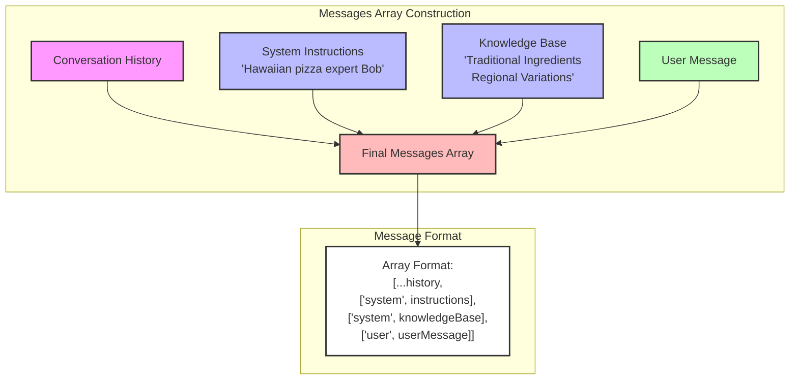
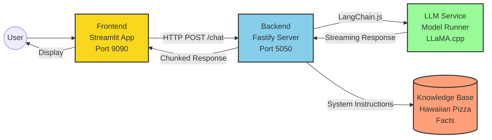

# Docker Model Runner with LangchainJS

## 🍍 The Hawaiian Pizza Guru 🍕

### Messages



### Architectures



Start the web application
```bash
docker compose up --build
#docker compose up --watch
```
Then, open: http://localhost:9090/


Conversational Chat with Bob
```text
Hello I'm Philippe
[As a poem] explain how to cook a pineapple pizza
# ok, give me the main ingredients
do you remember me?
```


Then try this in a terminal:

```bash
curl "http://localhost:5050/conversation?sessionId=default" | jq '.'
```

## Change the system instructions

```text
Speak like a pirate
```
