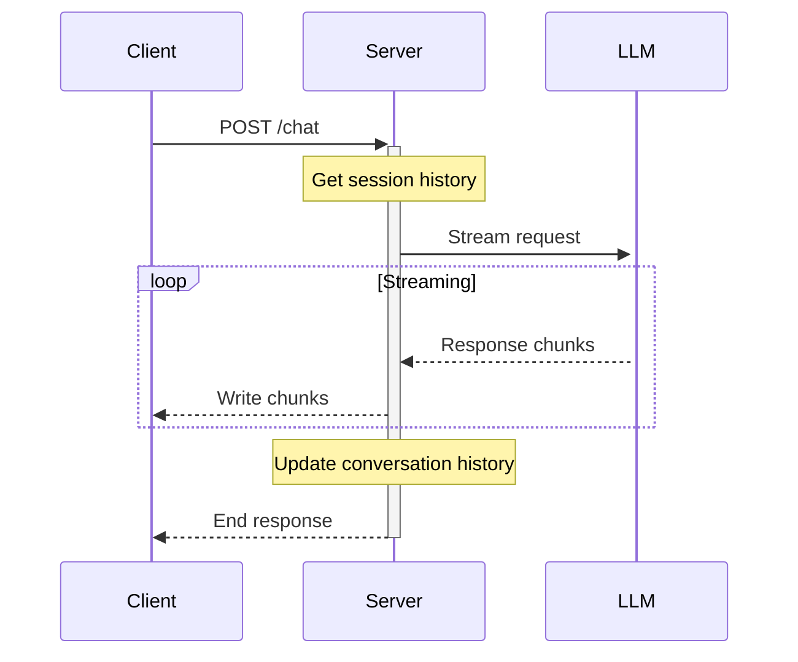
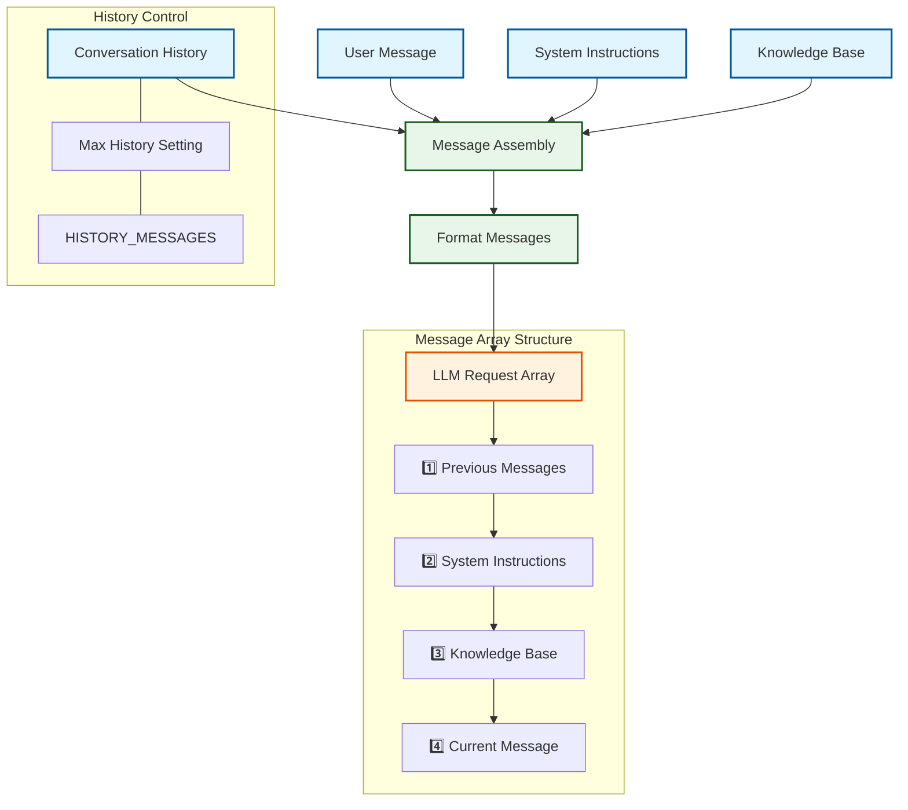

## Sequence

```mermaid
sequenceDiagram
    Client->>+Server: POST /chat
    Note over Server: Get session history
    Server->>+LLM: Stream request
    loop Streaming
        LLM-->>Server: Response chunks
        Server-->>Client: Write chunks
    end
    Note over Server: Update conversation history
    Server-->>-Client: End response
```

## Messages (for the query)

```mermaid
graph TD
    %% Style definitions
    classDef inputClass fill:#e1f5fe,stroke:#01579b,stroke-width:2px
    classDef processClass fill:#e8f5e9,stroke:#1b5e20,stroke-width:2px
    classDef outputClass fill:#fff3e0,stroke:#e65100,stroke-width:2px

    %% Input nodes
    UserMsg[User Message]:::inputClass
    History[Conversation History]:::inputClass
    Instructions[System Instructions]:::inputClass
    Knowledge[Knowledge Base]:::inputClass

    %% Process nodes
    Assembly[Message Assembly]:::processClass
    Format[Format Messages]:::processClass

    %% Output node
    FinalArray[LLM Request Array]:::outputClass

    %% Flow
    UserMsg --> Assembly
    History --> Assembly
    Instructions --> Assembly
    Knowledge --> Assembly

    Assembly --> Format

    Format --> FinalArray

    %% Array structure
    subgraph "Message Array Structure"
        direction TB
        FinalArray --> M1["1️⃣ Previous Messages"]
        M1 --> M2["2️⃣ System Instructions"]
        M2 --> M3["3️⃣ Knowledge Base"]
        M3 --> M4["4️⃣ Current Message"]
    end

    %% History Management
    subgraph "History Control"
        direction TB
        MaxHistory["Max History Setting"]
        EnvVar["HISTORY_MESSAGES"]
        History --- MaxHistory
        MaxHistory --- EnvVar
    end
```