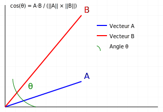

# Cosine Distance Between 2 Vectors

- **Cosine distance** measures the **similarity** between two vectors by calculating the cosine of the angle between them.
- The more similar the vectors are, the closer the cosine will be to 1.

## Key Points

- The distance varies between `-1` and `1`
- `1` means the vectors are identical (**same** direction)
- `-1` means they point in **opposite** directions

