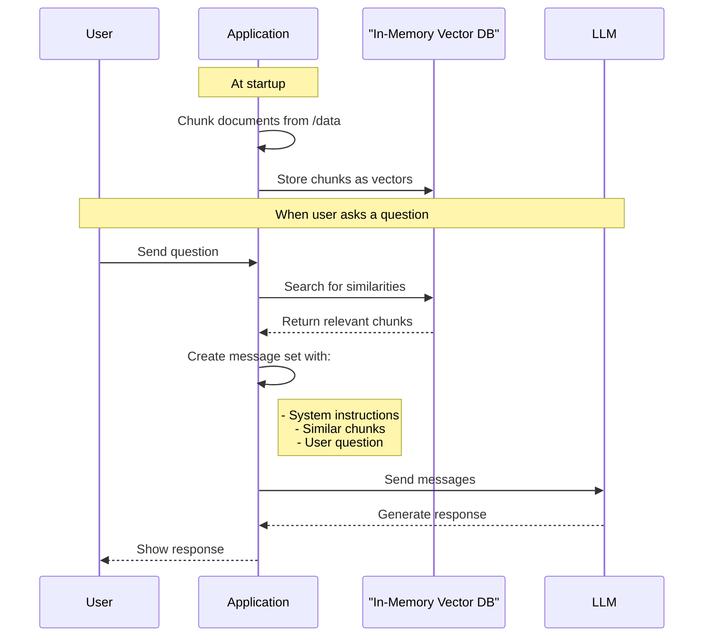
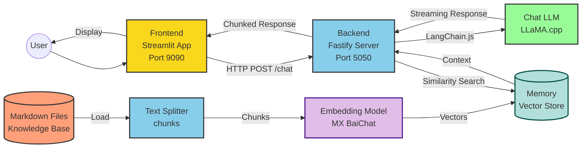

# Docker Model Runner with LangchainJS

## 🍍 The Hawaiian Pizza Guru 🍕 [RAG edition]

### Workflow


### Architecture


Show content of: 
- `/data`
- `/docs`


Start the web application
```bash
docker compose up --build
#docker compose up --watch
```
Then, open: http://localhost:9090/

Conversational Chat with Bob
```text
Is Hawaiian pizza really from Hawaii?
Tell me about the history of the pineapple pizza 
Is there a regional variation of the hawaiian pizza in Brazil?
Give me the list of the regional variations
```

## LangchainJS

### How to Split code

- https://js.langchain.com/docs/how_to/code_splitter/

## Memory Vector Store

- MemoryVectorStore: https://js.langchain.com/docs/integrations/vectorstores/memory/

