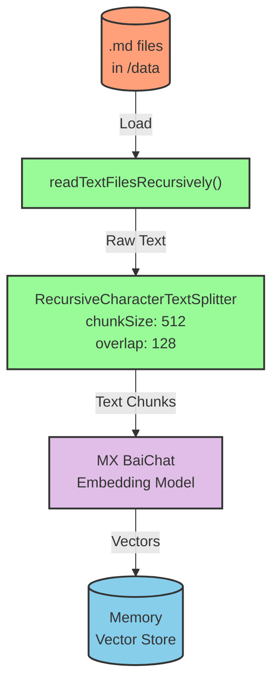
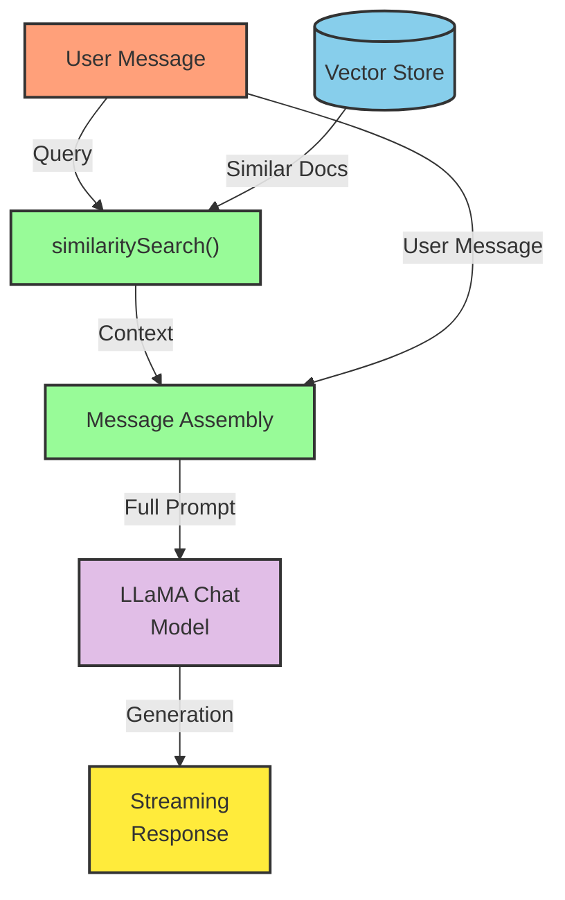

## Embeddings creation flow

```mermaid
graph TD
    %% Style definitions
    classDef fileClass fill:#ffa07a,stroke:#333,stroke-width:2px
    classDef processClass fill:#98fb98,stroke:#333,stroke-width:2px
    classDef storageClass fill:#87ceeb,stroke:#333,stroke-width:2px
    classDef modelClass fill:#e1bee7,stroke:#333,stroke-width:2px

    %% Nodes
    MD[(".md files<br/>in /data")]:::fileClass
    Read["readTextFilesRecursively()"]:::processClass
    Split["RecursiveCharacterTextSplitter<br/>chunkSize: 512<br/>overlap: 128"]:::processClass
    Embed["MX BaiChat<br/>Embedding Model"]:::modelClass
    Store[(Memory<br/>Vector Store)]:::storageClass

    %% Flow
    MD -->| Load| Read
    Read -->| Raw Text| Split
    Split -->| Text Chunks| Embed
    Embed -->| Vectors| Store
```

## Chat endpoint flow

```mermaid
graph TD
    %% Style definitions
    classDef inputClass fill:#ffa07a,stroke:#333,stroke-width:2px
    classDef processClass fill:#98fb98,stroke:#333,stroke-width:2px
    classDef storageClass fill:#87ceeb,stroke:#333,stroke-width:2px
    classDef modelClass fill:#e1bee7,stroke:#333,stroke-width:2px
    classDef outputClass fill:#ffeb3b,stroke:#333,stroke-width:2px

    %% Nodes
    Input["User Message"]:::inputClass
    Search["similaritySearch()"]:::processClass
    VStore[(Vector Store)]:::storageClass
    Combine["Message Assembly"]:::processClass
    LLM["LLaMA Chat<br/>Model"]:::modelClass
    Stream["Streaming<br/>Response"]:::outputClass

    %% Flow
    Input -->| Query| Search
    VStore -->| Similar Docs| Search
    Search -->| Context| Combine
    Input -->| User Message| Combine
    Combine -->| Full Prompt| LLM
    LLM -->| Generation| Stream
```