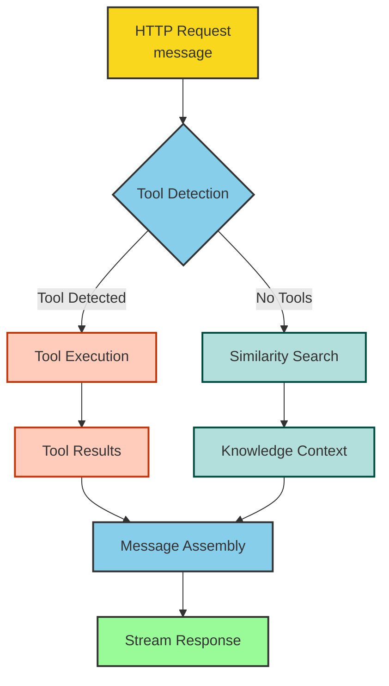
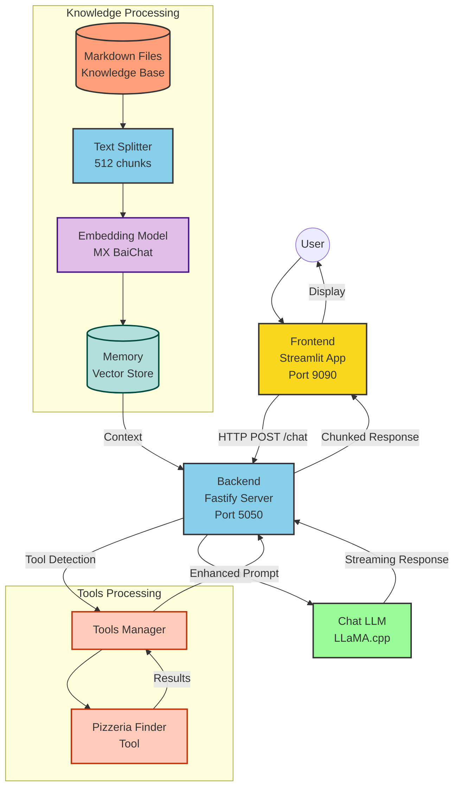

# Docker Model Runner with LangchainJS

## 🍍 The Hawaiian Pizza Guru 🍕 [Tools edition]


### Workflow



### Architecture



Start the web application
```bash
docker compose up --build
#docker compose up --watch
```
Then, open: http://localhost:9090/

Conversational Chat with Bob
```text
give me pizzerias addresses in Paris
give me pizzerias addresses in Roma and Paris
give me pizzerias addresses in Warsaw
```
