# Docker Model Runner with LangchainJS

## 🍍 The Hawaiian Pizza Guru 🍕 [MCP Tools edition]

```mermaid
graph TD
    %% Color definitions
    classDef frontendClass fill:#f9d71c,stroke:#333,stroke-width:2px
    classDef backendClass fill:#87ceeb,stroke:#333,stroke-width:2px
    classDef modelClass fill:#98fb98,stroke:#333,stroke-width:2px
    classDef dataClass fill:#ffa07a,stroke:#333,stroke-width:2px
    classDef embeddingClass fill:#e1bee7,stroke:#4a148c,stroke-width:2px
    classDef vectorClass fill:#b2dfdb,stroke:#004d40,stroke-width:2px
    classDef toolClass fill:#ffccbc,stroke:#bf360c,stroke-width:2px
    classDef mcpClass fill:#dcedc8,stroke:#33691e,stroke-width:2px

    %% User Layer
    User((User))

    %% Frontend Layer
    Frontend[Frontend<br/>Streamlit App<br/>Port 9090]:::frontendClass

    %% Backend Layer
    Backend[Backend<br/>Fastify Server<br/>Port 5050]:::backendClass

    %% Knowledge Processing Layer
    subgraph "Knowledge Processing"
        direction LR
        KB[(Markdown Files<br/>Knowledge Base)]:::dataClass
        Splitter[Text Splitter<br/> chunks]:::backendClass
        EmbeddingModel[Embedding Model<br/>MX BaiChat]:::embeddingClass
        VectorStore[(Memory<br/>Vector Store)]:::vectorClass
    end

    %% MCP Layer
    subgraph "MCP Infrastructure"
        direction LR
        MCPServer[MCP Server<br/>Port 3001]:::mcpClass
        MCPClient[MCP Client<br/>SSE Transport]:::mcpClass
        DynamicTools[Dynamic Tools<br/>JSON Schema → Zod]:::mcpClass
    end

    %% LLM Layer
    LLM[Chat LLM<br/>LLaMA.cpp]:::modelClass

    %% Connections
    User --> Frontend
    Frontend -->|HTTP POST /chat| Backend
    
    %% Knowledge Flow
    KB --> Splitter
    Splitter --> EmbeddingModel
    EmbeddingModel --> VectorStore
    VectorStore -->|Context| Backend
    
    %% MCP Flow
    Backend -->| Tool Detection| MCPClient
    MCPClient -->| SSE Connection| MCPServer
    MCPServer -->| Available Tools| MCPClient
    MCPClient -->| Schema Conversion| DynamicTools
    DynamicTools -->| Langchain Tools| Backend
    MCPClient -->| Tool Results| Backend
    
    %% LLM Flow
    Backend -->|Enhanced Prompt| LLM
    LLM -->|Streaming Response| Backend
    Backend -->|Chunked Response| Frontend
    Frontend -->|Display| User
```



Start the web application
```bash
docker compose up --build
#docker compose up --watch
```
Then, open: http://localhost:9090/

Conversational Chat with Bob
```text
give me pizzerias addresses in Paris
give me pizzerias addresses in Roma and Paris
give me pizzerias addresses in Warsaw
```

## LangchainJS MCP adapter
> I didn't use it

Project: https://github.com/langchain-ai/langchainjs-mcp-adapters
