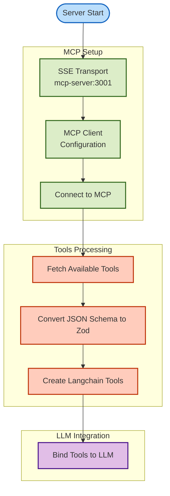
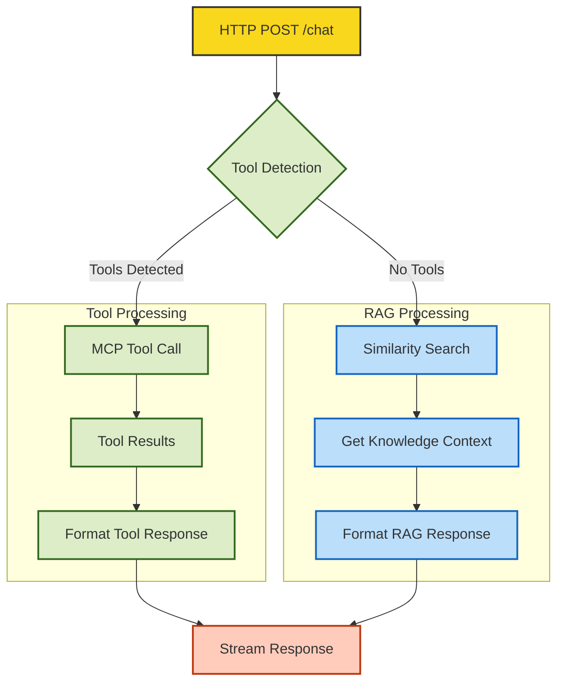

## MCP Client initialization and tools setup

```mermaid
graph TD
    %% Style definitions
    classDef mcpClass fill:#dcedc8,stroke:#33691e,stroke-width:2px
    classDef setupClass fill:#bbdefb,stroke:#1565c0,stroke-width:2px
    classDef toolClass fill:#ffccbc,stroke:#bf360c,stroke-width:2px
    classDef llmClass fill:#e1bee7,stroke:#4a148c,stroke-width:2px

    %% Initialization Flow
    Start([Server Start]):::setupClass
    
    subgraph "MCP Setup"
        direction TB
        Transport[SSE Transport<br/>mcp-server:3001]:::mcpClass
        Client[MCP Client<br/>Configuration]:::mcpClass
        Connect[Connect to MCP]:::mcpClass
    end
    
    subgraph "Tools Processing"
        direction TB
        FetchTools[Fetch Available Tools]:::toolClass
        SchemaConvert[Convert JSON Schema to Zod]:::toolClass
        CreateTools[Create Langchain Tools]:::toolClass
    end
    
    subgraph "LLM Integration"
        BindTools[Bind Tools to LLM]:::llmClass
    end

    %% Flow
    Start --> Transport
    Transport --> Client
    Client --> Connect
    Connect --> FetchTools
    FetchTools --> SchemaConvert
    SchemaConvert --> CreateTools
    CreateTools --> BindTools
```

## Chat endpoint

```mermaid
graph TD
    %% Style definitions
    classDef inputClass fill:#f9d71c,stroke:#333,stroke-width:2px
    classDef mcpClass fill:#dcedc8,stroke:#33691e,stroke-width:2px
    classDef ragClass fill:#bbdefb,stroke:#1565c0,stroke-width:2px
    classDef outputClass fill:#ffccbc,stroke:#bf360c,stroke-width:2px

    %% Request handling
    Request[HTTP POST /chat]:::inputClass
    ToolDetect{Tool Detection}:::mcpClass

    %% Tool path
    subgraph "Tool Processing"
        direction TB
        MCPCall[MCP Tool Call]:::mcpClass
        ToolResult[Tool Results]:::mcpClass
        FormatTool[Format Tool Response]:::mcpClass
    end

    %% RAG path
    subgraph "RAG Processing"
        direction TB
        Search[Similarity Search]:::ragClass
        Context[Get Knowledge Context]:::ragClass
        FormatRAG[Format RAG Response]:::ragClass
    end

    %% Response generation
    Stream[Stream Response]:::outputClass

    %% Flow
    Request --> ToolDetect
    
    ToolDetect -->|Tools Detected| MCPCall
    MCPCall --> ToolResult
    ToolResult --> FormatTool
    FormatTool --> Stream
    
    ToolDetect -->|No Tools| Search
    Search --> Context
    Context --> FormatRAG
    FormatRAG --> Stream
```