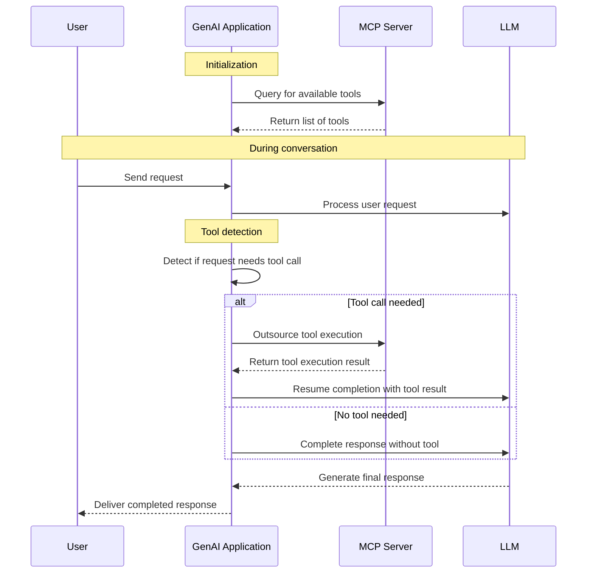
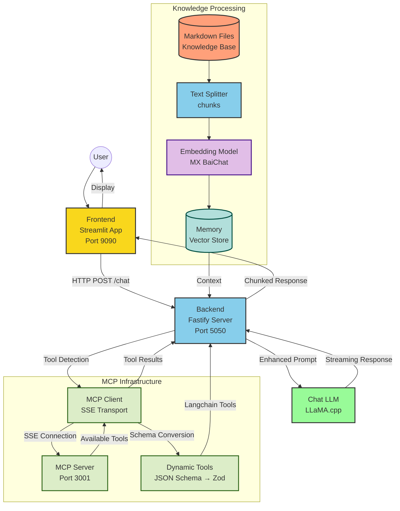

# Docker Model Runner with LangchainJS

## 🍍 The Hawaiian Pizza Guru 🍕 [MCP Tools edition]

This demo use LangchainJS with MCP tools to create a pizza expert chatbot.
The tool queries the knowledge base (https://github.com/hawaiian-pizza-corp/api) and returns the results to the user.

### Workflow



### Architecture



Start the web application:
```bash
docker compose up --build
#docker compose up --watch
```
Then, open: http://localhost:9090/

Conversational Chat with Bob
```text
give me pizzerias addresses in Paris

give me pizzerias addresses in Paris and add fancy and appropriate emojis.

give me pizzerias addresses in Roma and Paris
give me pizzerias addresses in Warsaw
```

## LangchainJS MCP adapter
> I didn't use it

Project: https://github.com/langchain-ai/langchainjs-mcp-adapters
