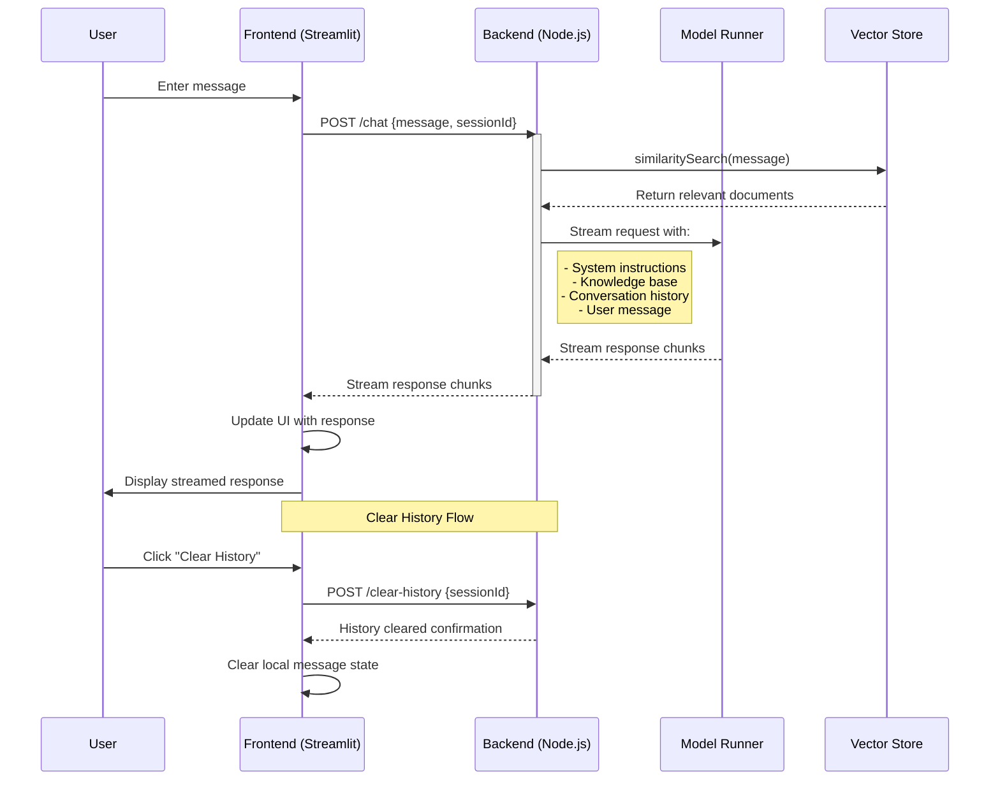

# Play with Docker Model Runner

```bash
MODEL_RUNNER_BASE_URL=http://localhost:12434 go run main.go
```


```mermaid
sequenceDiagram
    participant User
    participant Frontend as Frontend (Streamlit)
    participant Backend as Backend (Node.js)
    participant ModelRunner as Model Runner
    participant VectorStore as Vector Store

    User->>Frontend: Enter message
    Frontend->>Backend: POST /chat {message, sessionId}
    
    activate Backend
    Backend->>VectorStore: similaritySearch(message)
    VectorStore-->>Backend: Return relevant documents
    
    Backend->>ModelRunner: Stream request with:
    note right of Backend: - System instructions<br>- Knowledge base<br>- Conversation history<br>- User message
    
    ModelRunner-->>Backend: Stream response chunks
    Backend-->>Frontend: Stream response chunks
    deactivate Backend
    
    Frontend->>Frontend: Update UI with response
    Frontend->>User: Display streamed response

    note over Frontend,Backend: Clear History Flow
    User->>Frontend: Click "Clear History"
    Frontend->>Backend: POST /clear-history {sessionId}
    Backend-->>Frontend: History cleared confirmation
    Frontend->>Frontend: Clear local message state
```