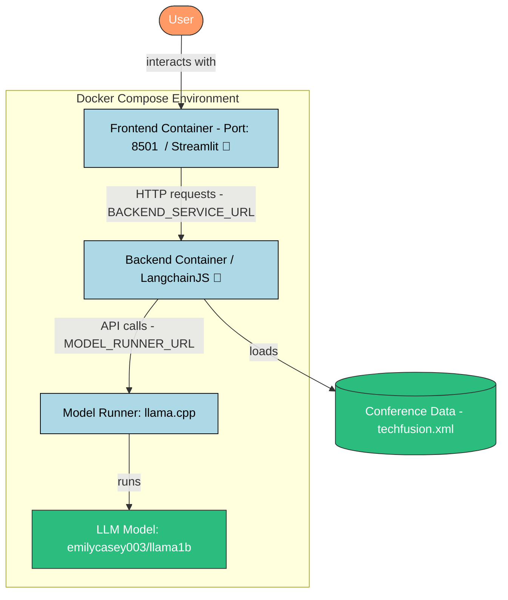

# 🤖 TechFusion 2025 Conference AI Assistant
> This version of the demo of "TechFusion 2025" is handling the conversational memory and the user session

Welcome to the coolest conference companion you'll ever meet! This AI-powered chatbot knows everything about TechFusion 2025, where WebAssembly meets container orchestration and AI in an epic tech fusion.

## ✨ What's This All About?

Imagine having a super-smart friend who knows everything about TechFusion 2025's keynote and all ten amazing talks. That's exactly what we built! Our AI assistant is always ready to chat about the latest in WebAssembly, container orchestration, and AI innovations.

## 🎯 The Cool Stuff We Used

### 🧠 AI Brain (Docker Model Runner)
- Runs on tiny-but-mighty LLMs (`tinyllama` or `llama1b`)
- Serves knowledge faster than you can say "WebAssembly"!

### ⚡ Backend Magic
- Powered by Node.js and the amazing LangChainJS
- Manages a structured XML file (`techfusion.xml`) containing all conference information
- Enriches AI responses with accurate conference data
- Works as the matchmaker between you and the AI
- Wraps everything in a nice API bow

### 💅 Frontend Sparkle
- Beautiful, intuitive interface for chatting
- Makes complex AI interactions feel like texting a friend
- Looks good while doing it!

## 🎯 How It Works

Our backend loads the conference program from a structured XML file (techfusion.xml) that contains all the juicy details about the keynote and talks. When you ask a question, the backend combines this conference data with the AI's natural language capabilities to give you accurate, contextual answers about TechFusion 2025.

## 🌟 Why It's Awesome


- Everything runs in containers - because we're fancy like that
- Microservices architecture that would make any tech architect proud
- Real-time responses faster than you can grab your coffee ☕

## 🚀 Get It Running

### Prerequisites
- Docker & Docker Compose 

### Quick Start 
```bash
# Clone this beauty
git clone git@gitlab.com:docker-sa/docker-model-runner/techfusion.git
# or
https://gitlab.com/docker-sa/docker-model-runner/techfusion.git
# Jump into the action
cd techfusion

# Launch the magic
docker compose up

# Grab a coffee while containers do their thing ☕
```

## 🤝 Join the Fun!

Got ideas? We'd love to see them! MRs are like presents - always welcome! 🎁

## 📜 License

MIT License (Keep it legal, folks!)

## 📬 Get in Touch

Found a bug? Want to chat? Have coffee recommendations? ☕
[Use issues](https://gitlab.com/docker-sa/docker-model-runner/techfusion/-/issues)


# 🏛️ Architecture




---

Made with 💖 and probably too much caffeine